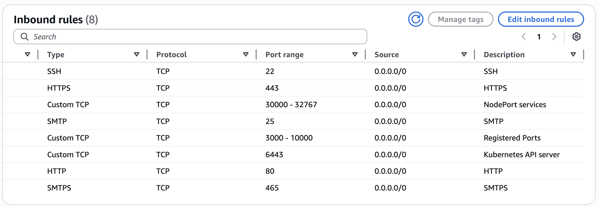

# Full Stack MERN APP

## Tech stack used in this project:
- GitHub (Code)
- Docker (Container)
- Jenkins (CI)
- ArgoCD (CD)
- OWASP (Dependency check)
- SonarQube (Quality)
- Trivy (Filesystem Scan)
- AWS EKS (Kubernetes)
- Helm (Monitoring using Grafana and Prometheus)


### Pre-requisites to implement this project:

> This project will be deployed on United States (Oregon) - us-west-2 but deploy your preffered region.

- <b>Create 1 Master machine on AWS with 2CPU, 8GB of RAM (t2.large) and 30 GB of storage manually or using Terraform.</b>
#
- <b>Open all the PORTs in security group of master machine</b> <br />

> We are creating this master machine because we will configure Jenkins master, eksctl, EKS cluster creation from here.

Install & Configure Docker by using below command, "NewGrp docker" will refresh the group config hence no need to restart the EC2 machine.

```bash
sudo apt-get update
```
```bash
sudo apt-get install docker.io -y

sudo usermod -aG docker ubuntu && newgrp docker 

OR

sudo chmod 777 /var/run/docker.sock
```
#
- <b id="Jenkins">Install and configure Jenkins (Master machine)</b>
```bash
sudo apt update -y
sudo apt install fontconfig openjdk-17-jre -y

sudo wget -O /usr/share/keyrings/jenkins-keyring.asc \
  https://pkg.jenkins.io/debian-stable/jenkins.io-2023.key
  
echo "deb [signed-by=/usr/share/keyrings/jenkins-keyring.asc]" \
  https://pkg.jenkins.io/debian-stable binary/ | sudo tee \
  /etc/apt/sources.list.d/jenkins.list > /dev/null
  
sudo apt-get update -y
sudo apt-get install jenkins -y
```
- <b>Now, access Jenkins Master on the browser on port 8080 and configure it</b>.
#
- <b id="EKS">Create EKS Cluster on AWS (Master machine)</b>
  - IAM user with **access keys and secret access keys**
  - AWSCLI should be configured </a>
  ```bash
  curl "https://awscli.amazonaws.com/awscli-exe-linux-x86_64.zip" -o "awscliv2.zip"
  sudo apt install unzip
  unzip awscliv2.zip
  sudo ./aws/install
  aws configure
  ```

  - Install **kubectl** 
  ```bash
  curl -o kubectl https://amazon-eks.s3.us-west-2.amazonaws.com/1.19.6/2021-01-05/bin/linux/amd64/kubectl
  chmod +x ./kubectl
  sudo mv ./kubectl /usr/local/bin
  kubectl version --short --client
  ```

  - Install **eksctl** (Master machine) 
  ```bash
  curl --silent --location "https://github.com/weaveworks/eksctl/releases/latest/download/eksctl_$(uname -s)_amd64.tar.gz" | tar xz -C /tmp
  sudo mv /tmp/eksctl /usr/local/bin
  eksctl version
  ```
  
  - <b>Create EKS Cluster (Master machine)</b>
  ```bash
  eksctl create cluster --name=mega \
                      --region=us-west-2 \
                      --version=1.30 \
                      --without-nodegroup
  ```
  - <b>Associate IAM OIDC Provider (Master machine)</b>
  ```bash
  eksctl utils associate-iam-oidc-provider \
    --region us-west-2 \
    --cluster mega \
    --approve
  ```
  - <b>Create Nodegroup (Master machine)</b>
  ```bash
  eksctl create nodegroup --cluster=mega \
                       --region=us-west-2 \
                       --name=mega \
                       --node-type=t2.large \
                       --nodes=2 \
                       --nodes-min=2 \
                       --nodes-max=2 \
                       --node-volume-size=29 \
                       --ssh-access \
                       --ssh-public-key=eks-nodegroup-key 
  ```

>  Make sure the ssh-public-key "eks-nodegroup-key" is available in your aws account

- <b id="Sonar">Install and configure SonarQube (Master machine)</b>
```bash
docker run -itd --name SonarQube-Server -p 9000:9000 sonarqube:lts-community
```
#
- <b id="Trivy">Install Trivy (Jenkins Master)</b>
```bash
sudo apt-get install wget apt-transport-https gnupg lsb-release -y
wget -qO - https://aquasecurity.github.io/trivy-repo/deb/public.key | sudo apt-key add -
echo deb https://aquasecurity.github.io/trivy-repo/deb $(lsb_release -sc) main | sudo tee -a /etc/apt/sources.list.d/trivy.list
sudo apt-get update -y
sudo apt-get install trivy -y
```

#
## Add email notification

#
## Steps to implement the project:
- <b>Go to Jenkins Master and click on <mark> Manage Jenkins --> Plugins --> Available plugins</mark> install the below plugins:</b>
  - OWASP
  - SonarQube Scanner
  - Docker
  - Pipeline: Stage View
  - Blue Ocean
#
## Clean Up
- <b id="Clean">Delete eks cluster</b>
```bash
eksctl delete cluster --name=mega --region=us-west-2
```
